# Threatsphere Firewall configuration

##  Prerequisites
  - virtualbox 😃/VM ware ☹️
  - PFsense iso installed
  - A windows pc 

Please refer to [this](https://github.com/eth-hac-steven/Home-lab-Virtual-Machine-Setup/tree/main/PFsense%20Firewall%20Installation) to install the firewall iso in virtualbox

### Note 
- when setting the hostname, avoid uppercases letters
- If you want to use  your physical system 
   - change Adapter 2 on the Pfsense VM to Host-only connection
   - Then follow the step 
- This allows your physical system to speak directly to the firewall bypassing the need on the Win 11 vm(still recommended though)

### PFsense  setup
- Device Setup
   - Make sure that the win pc and  PFsense are on the same LAN network 

- Start the Machines
- On PFsense you should see this

       

- Take note of the LAN IP address : 192.168.1.1/24
- On the Win system go to your browser
- Enter the IP address in the url bar
- This warning should come up
  
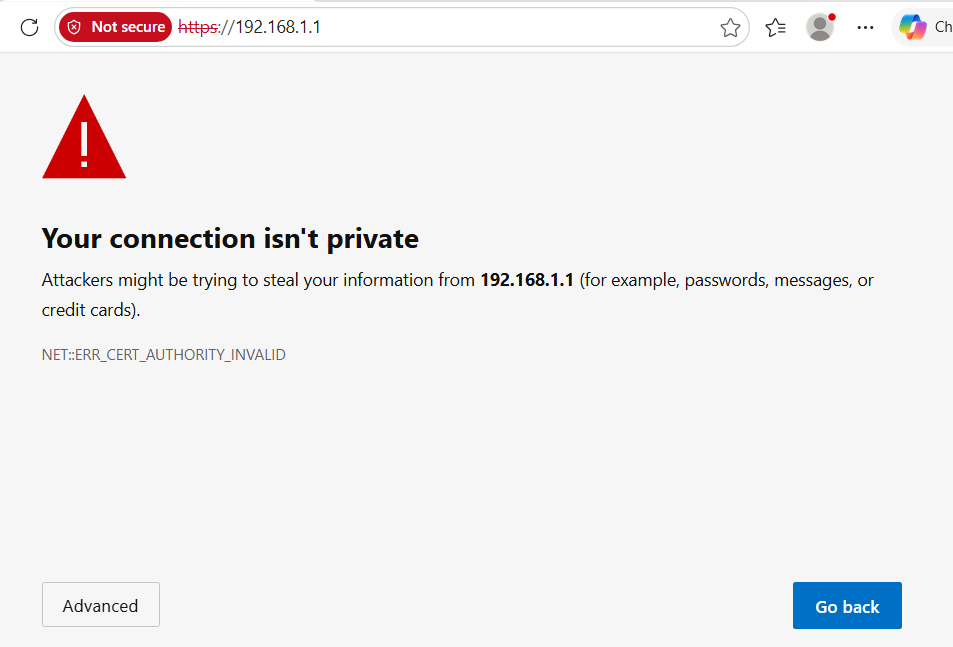

- Click ```Advance``` 
- Click on ```continue to 192.168.1.1```
- which bring you to the login page

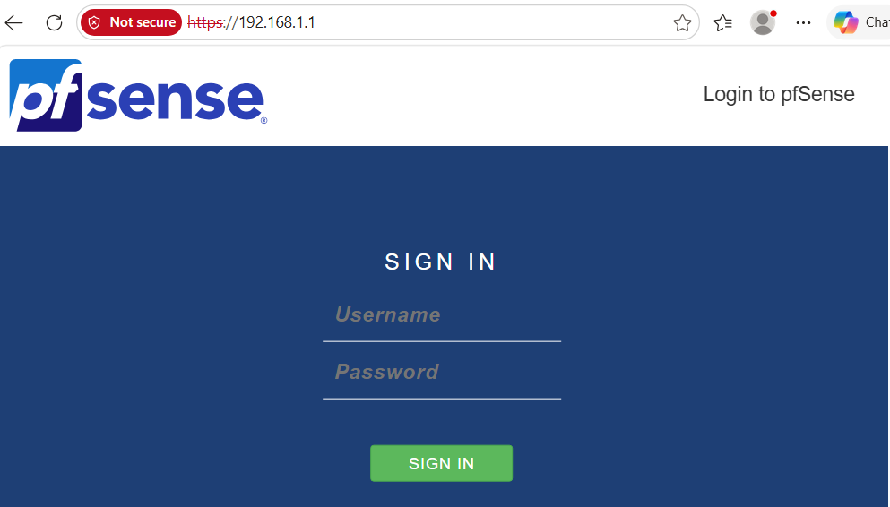

- The username : admin
- The password : pfsense

Welcome to the Pfsense dashbaord
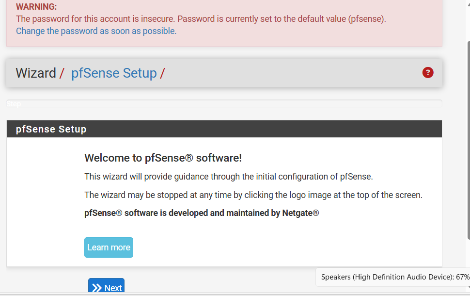
 
like the screenshot says the ```wizard provides guidance through the initial configuration of pfsense```, so

- click ```Next```

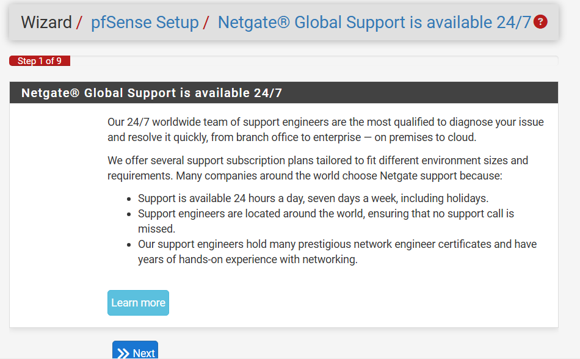

- click ```Next```

### General information section
 - leave the hostname as the default
   - if you have something custom you can enter it eg ```threatspherecon```
- leave the Domain-name as the default
   - if you have something custom you can also enter it eg NW.firewall.

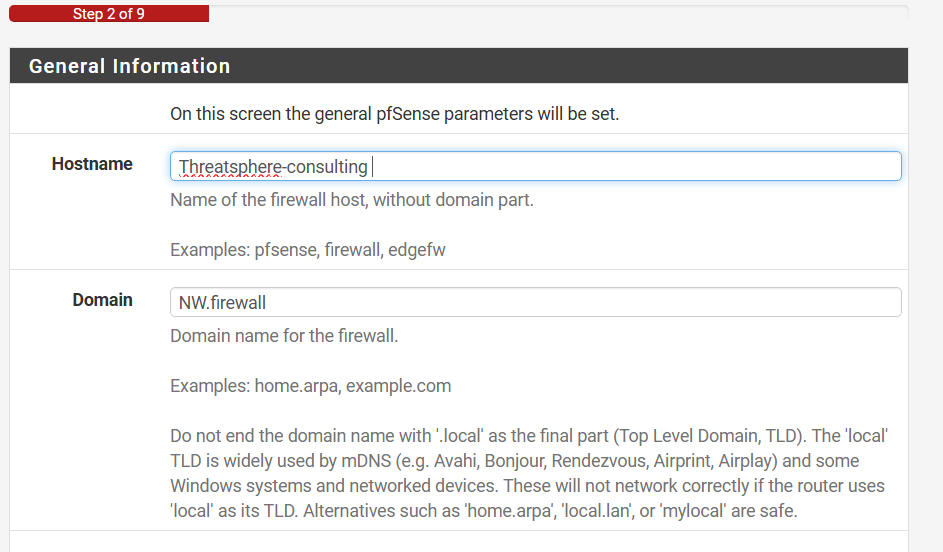

- leave the Primary and Secondary DNS as is (Blank), can be configure later if needed.

.png) 
- Click ```next```

### Time Server section
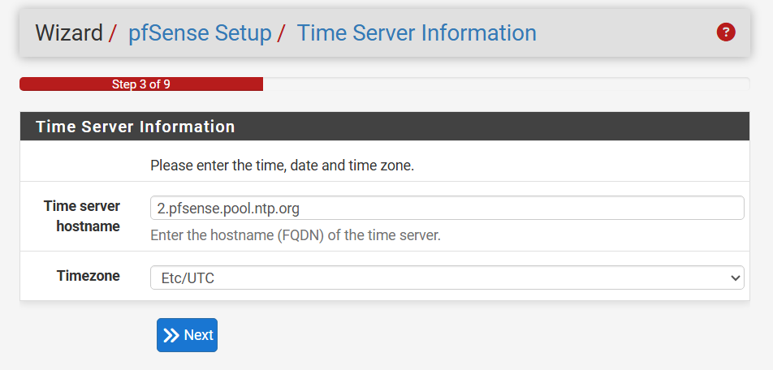 
- Click ```next```

### Configure WAN interface
  
  The WAN aka Wide area network is responsible for recieving internet from the ISP (Internet Sevice provider).

 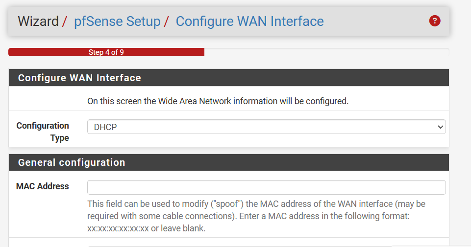

- leave the configuration Type as "DHCP"
   - This should be only set to static if you and your ISP has agreed upon a specific IP that will be used to deliver internet to your Enterprise

- Leave all other as is 

- Check Both options in the RFC section

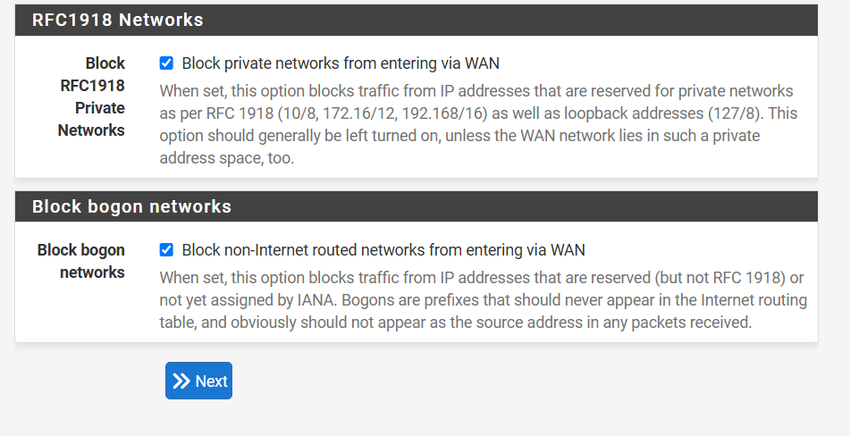

- Click Next
 
### Configure LAN interface
 This section is where device would be connected and be able to recieve internet connection.

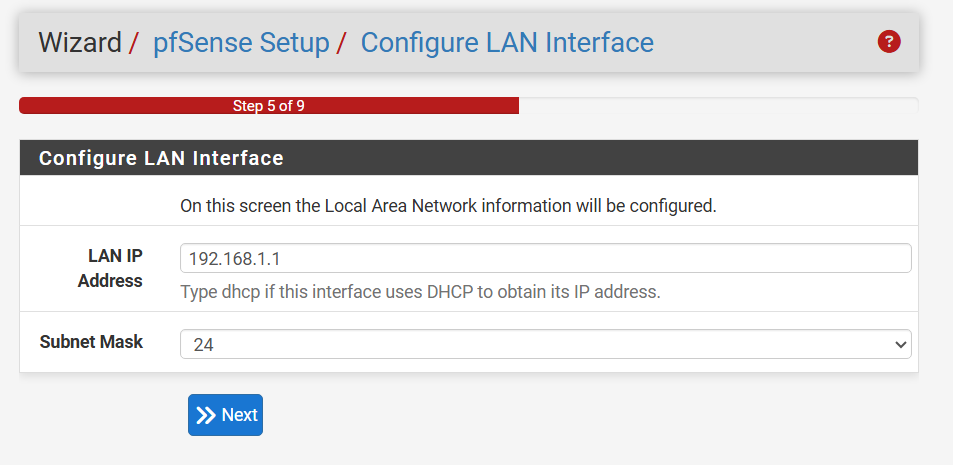

- leave as is 

- click Next

### Setting A New Admin Password

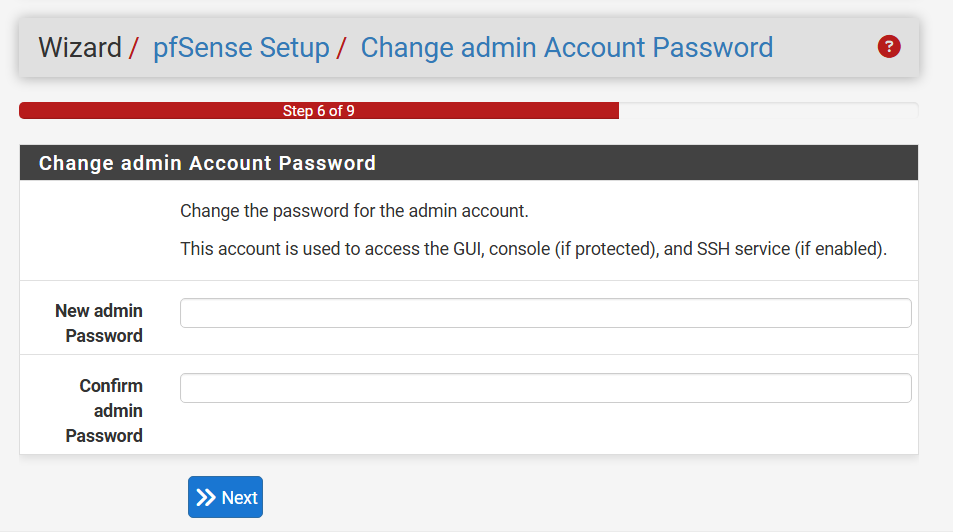

- set a new admin password
   - This is important even in a homelab like this as default password also leads to breaches in actual enterprise enviroment, practice make perfect.

- Click Next

###  Reload to save configuration

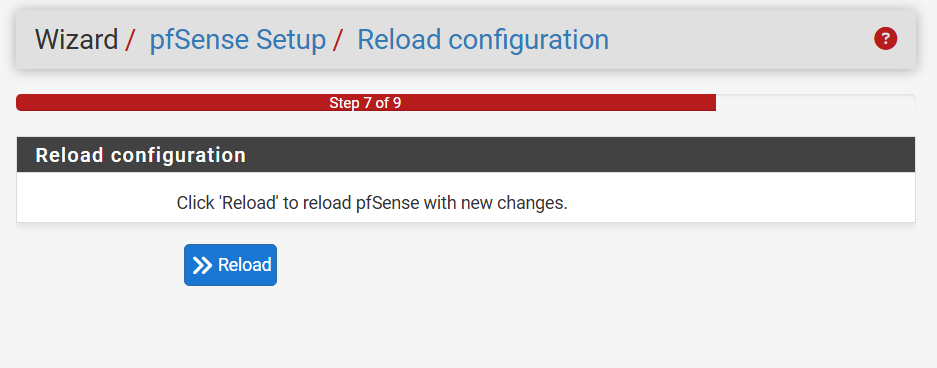


- Click Reload 

### Wizard Complete

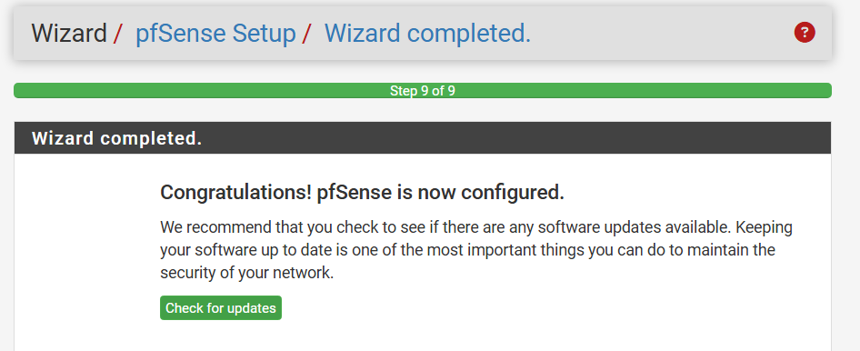

- click Finish

### Dashboard

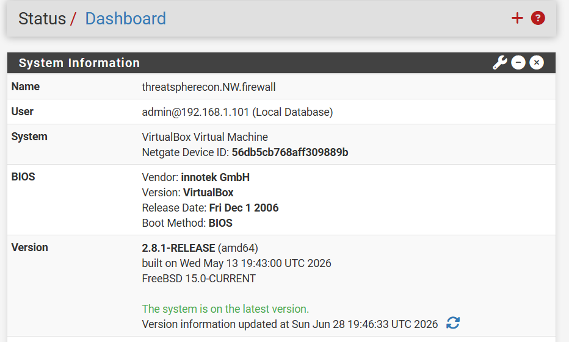

#### PFsense Configuration Completed
   Congrats, with this the Firewall is up and running but more configuration is needed for the best security, configs like

   - Vlan Segmentation
   - Captive Portal
   - Bandwith control
   - firewall rules
   - Content-filtering 
   - and more ....


